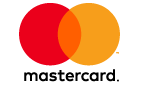
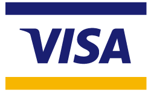
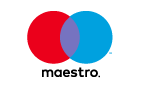
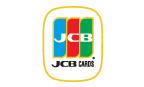
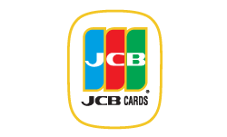

# CityPay Card Scheme Logos

Card scheme logos used throughout our products and services including eps and Illustrator sources.

## Mastercard

## Visa

## Maestro

## American Express

## Diners

## JCB

